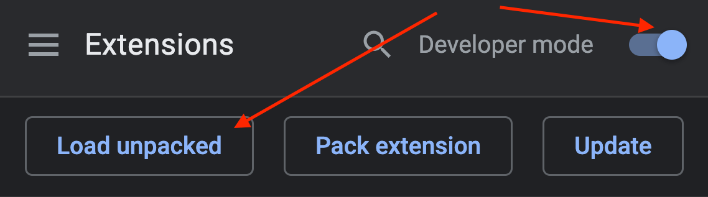

# Blade's WLED HTTP/JSON API-Tester with React !!

Chrome Extension now on React starting with v0.7.x


## Features

- Built with react
- State management handled by redux & chrome-localStorage
- HTTP-API Tester (incl. fully customizable FX-List)
  - Active State
  - Countdown on NL-Effects
  - proper state-handling even on close/reopen
- JSON-API Tester (incl. JSON-Editor and Stored List)
- InfoButton to toggle "Helper-Bubbles"

## Install

1. [Download Extension](https://github.com/YeonV/Blade-WLED-Extension-React/releases/download/v0.7.5/Blade_WLED_v0.7.5.zip) & unzip
2. GoTo [Chrome Extensions](chrome://extensions)
3. Toggle Developer mode -> Load unpacked -> select Folder



## How To

click on the info-icon at the topper right corner.

> please don't use the app while helper-bubbles are opened, might lead to a visual bug. you can also repress the info-button after the visual-bug to fix it.

## Notes

- "add new effect"- and "IP"-inputs can also be confirmed with "Enter"-key
- clicking the icon of an effect-parameter toggles the whole parameter (i.e. the sun-icon at the brightness sliders toggles if whole brightness-parameter)

---

## Development

```
git clone https://github.com/YeonV/Blade-WLED-Extension-React.git
cd Blade-WLED-Extension-React
```

---

Starting DEV-Server (with hotReload):

```
yarn
yarn start
```

=> use `build` folder as Chrome-Extension

---

Building Extension (Production):

```
yarn
yarn build
```

=> use `build` folder as Chrome-Extension

# Credits

brother in arms and mentor: https://github.com/monestereo

wled: https://github.com/Aircoookie/WLED

wled's creator Aircookie and the community

extension's react-base used: https://github.com/lxieyang/chrome-extension-boilerplate-react

okok, that noob of past's blade also did things... https://github.com/YeonV/Blade-WLED-Extension
