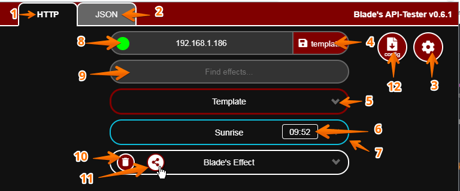

# Blade's WLED HTTP/JSON API-Tester with React

Chrome Extension now on React starting with v0.7.x

***not functional yet***

### Features

- Fully with react
- State management handled by redux
- Proper module isolation
- Tested: send commands to wled sucessfully
- Tested: Permissions seems to play nicely
- Imported & partly fixed: Some views+ui-elements
- Implemented internal state-handling

### ToDo:
- fix rest of UI
- adopt functionality (scripts, handlers, ...)
- after testing -> connect redux-store to chrome-(local/sync)-storage

---

## Before React:

https://github.com/YeonV/Blade-WLED-Extension

## Screenshot

| \#  | Function                      |
| --- | ----------------------------- |
| 1   | HTTP-API-Tester               |
| 2   | JSON-API-Tester               |
| 3   | Toggle Settings               |
| 4   | Save Template                 |
| 5   | Modify Template               |
| 6   | Current effect countdown      |
| 7   | Current effect active state   |
| 8   | WLED Online/Offline state     |
| 9   | Live Search Effects           |
| 10  | Delete this effect            |
| 11  | Share this effect on WLED-CMS |
| 12  | Save current config.js\*      |

---

Extension's React-Base used: https://github.com/lxieyang/chrome-extension-boilerplate-react
