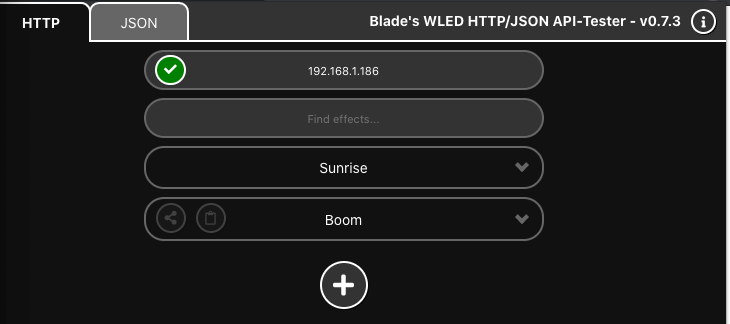

# Blade's WLED HTTP/JSON API-Tester with React

Chrome Extension now on React starting with v0.7.x

## Features

- Built with react
- State management handled by redux & chrome-localStorage
- HTTP-API Tester (incl. fully customizable FX-List)
  - Active State
  - Countdown on NL-Effects
  - proper state-handling even on close/reopen
- JSON-API Tester (incl. JSON-Editor)
- InfoButton to toggle "Helper-Bubbles"
  > please don't use the app while helper-bubbles are opened, might lead to a visual bug. you can also repress the info-button after the visual-bug to fix it.

## ToDo

- Better define to which state to restore on "abort-Effect"
- Maybe lock UI while info-bubbles opened or auto-close bubbles on next click
- Start Project: WLED-CMS-Synergies
- Make use of the 'options/settings'-page inside chrome

## Notes

- "add new effect"- and "IP"-inputs can also be confirmed with "Enter"-key
- clicking the icon of an effect-parameter toggles the whole parameter (i.e. the sun-icon at the brightness sliders toggles if whole brightness-parameter)

---

# Credits

brother in arms and mentor: https://github.com/monestereo

wled: https://github.com/Aircoookie/WLED

wled's creator Aircookie and the community

extension's react-base used: https://github.com/lxieyang/chrome-extension-boilerplate-react

okok, that noob of past's blade also did things... https://github.com/YeonV/Blade-WLED-Extension
